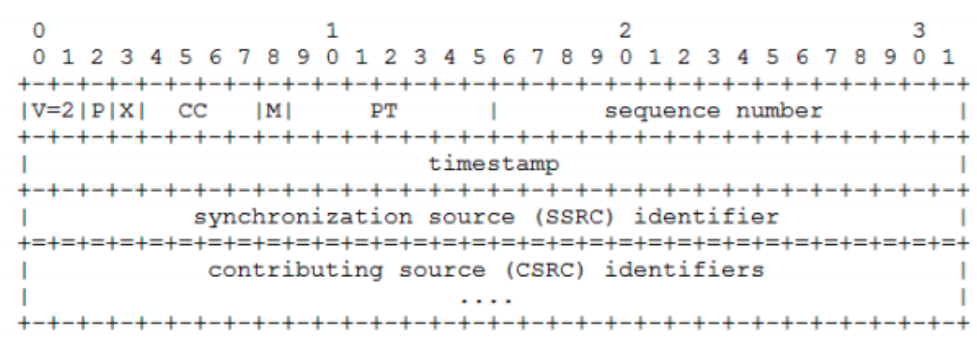
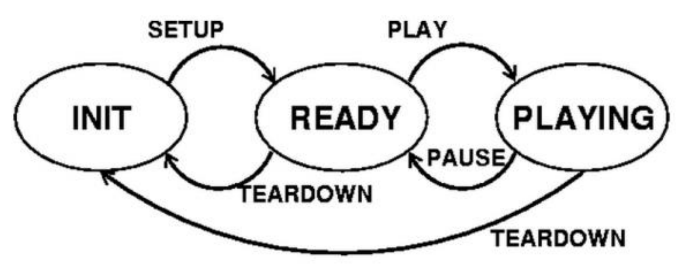

# RTP protocol headers

- version: 2 bits
- padding: 1 bit
- extension: 1 bit
- cc:  4 bits
- marker: 1 bit
- payload type: 7 bits
- sequence number: 16 bits
- timestamp: 32 bits

# Send RTSP request `sendRtspRequest`

Based on the state diagram to set up the guard conditions
for sending a variety of Request codes
- SETUP request <=> self.state = INIT
- PLAY request <=> self.state = READY
- PAUSE request <=> self.state = PLAYING
- TEARDOWN request <=> self.state in [READY, PLAYING]
- Otherwise, ignore the request

# User manual
- Running server: `python server.py 3000`
- Running client code `python ClientLauncher.py localhost 3000 3001 movie.Mjpeg`

# Extended requirements
## Q1: Statistics about RTP session
## Q2: UI changes
> SETUP button removal

Merge the SETUP button into the PLAY button
    If the play button is pressed for the first time => send RTSP SETTUP method to the server
> Is it appropriate to send TEARDOWN when the user clicks on the STOP button?

Yes, the stop button in other media players need to be assigned to a teardown command.
While some media players assign a pause command to the stop button to allow user
continue the playback where he/she left off. However, in our case, we already assign pause command to
pause button; the teardown command must be assigned to the stop button if we
still want to keep the button on the interface.
